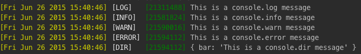

# console-stamp

[![npm][npm-image]][npm-url]
[![downloads][downloads-image]][downloads-url]
[![build][build-img]][downloads-url]

[npm-image]: https://img.shields.io/npm/v/console-stamp.svg?style=flat-square
[npm-url]: https://npmjs.org/package/console-stamp
[build-img]: https://img.shields.io/circleci/project/github/starak/node-console-stamp/0.2.8.svg?style=flat-square
[downloads-image]: https://img.shields.io/npm/dm/console-stamp.svg?style=flat-square
[downloads-url]: https://npmjs.org/package/console-stamp

## Attention! ##

Version 3.0.0 (! don't ask...) Release Candidate is now out! Try it out by using the `@next` tag like this:

    npm install console-stamp@next
    
Documentation for 3.0.0 can be found [here](https://github.com/starak/node-console-stamp/tree/3.0.0) for now... 

**Note:** There are breaking changes in the new version.

--------------------------

This module enables you to patch the console's methods in Node.js, to add timestamp prefix based on a given string pattern, and more...

## Usage ##

### Install
```console
npm install console-stamp
```

### Patching the console
```js
require('console-stamp')(console, [options]);
```

#### console
The global console or [custom console](#customconsole).

#### options {Object|String}

From version 2.0 the second parameter is an object with several options. As a backward compatibillity feature this parameter can be a string containing the pattern.

* **options.pattern** {String}<br>A string with date format based on [Javascript Date Format](http://blog.stevenlevithan.com/archives/date-time-format)<br>**Default**: 'ddd mmm dd yyyy HH:MM:ss'

* **options.formatter** {Function}<br>A custom date formatter that should return a formmatted date string.

* **options.label** {Boolean}<br>If true it will show the label (LOG | INFO | WARN | ERROR)<br>**Default**: true

* **options.labelPrefix** {String}<br>A custom prefix for the label.<br>For an example see [Custom prefix and suffix example](#custom-pre-and-suffixes)<br>**Default:** "["

* **options.labelSuffix** {String}<br>A custom suffix for the label.<br>For an example see [Custom prefix and suffix example](#custom-pre-and-suffixes)<br>**Default:** "]"

* **options.include** {Array}<br>An array containing the methods to include in the patch<br>**Default**: ["log", "info", "warn", "error", "dir", "assert"]

* **options.exclude** {Array}<br>An array containing the methods to exclude in the patch<br>**Default**: [] \(none)

* **options.disable** {Array}<br>An array containing the methods to disable in the patch<br>**Default**: [] \(none)

* **options.level** {String}<br>A string choosing the most verbose logging function to allow. Ordered/grouped as such: 'log dir', 'info', 'warn assert', 'error'<br>**Default**: log

* **options.extend** {Object}<br>An object describing methods and their associated log level, to extend the existing `method <-> log level` pairs.<br>For an example see [Custom methods](#custommethods).

* **options.metadata** {String/Object/Function}<br>Types can be String, Object (interpreted with util.inspect), or Function. See the test-metadata.js for examples.<br>**Note** that metadata can still be sent as the third parameter (as in vesion 1.6) as a backward compatibillity feature, but this is deprecated. <br>**Default**: undefined

* **options.stdout** {WritableStream}<br>A custom `stdout` to use with [custom console](#customconsole).<br>**Default:** `process.stdout`

* **options.stderr** {WritableStream}<br>A custom `stderr` to use with [custom console](#customconsole).<br>**Default:** `options.stdout` or `process.stdout`

* **options.colors** {Object}<br>An object representing a color theme. More info [here](https://www.npmjs.com/package/chalk).

    * **options.colors.stamp** {String/Array<String>/Function} <br>**Default:** []

    * **options.colors.label** {String/Array<String>/Function} <br>**Default:** []

    * **options.colors.metadata** {String/Array<String>/Function} <br>**Default:** []
    
* **options.datePrefix** {String}<br>A custom prefix for the datestamp.<br>For an example see [Custom prefix and suffix example](#custom-pre-and-suffixes)<br>**Default:** "["

* **options.dateSuffix** {String}<br>A custom suffix for the datestamp.<br>For an example see [Custom prefix and suffix example](#custom-pre-and-suffixes)<br>**Default:** "]"
Note: To combine colors, bgColors and style, set them as an array like this:
```js
...
    stamp: ['black', 'bgYellow', 'underline']
...
```

Or chain Chalk functions like this:
```js
...
stamp: require('chalk').red.bgYellow.underline;
...
```

Note also that by sending the parameter `--no-color` when you start your node app, will prevent any colors from console.
```console
$ node my-app.js --no-color
```
### Example
```js
// Patch console.x methods in order to add timestamp information
require('console-stamp')(console, { pattern: 'dd/mm/yyyy HH:MM:ss.l' });

console.log('Hello World!');
// -> [26/06/2015 14:02:48.062] [LOG] Hello World!

const port = 8080;
console.log('Server running at port %d', port);
// -> [26/06/2015 16:02:35.325] [LOG] Server running at port 8080
```
&nbsp;
```js
console.log('This is a console.log message');
console.info('This is a console.info message');
console.warn('This is a console.warn message');
console.error('This is a console.error message');
console.dir({bar: 'This is a console.dir message'});
```
Result:
```console
[26/06/2015 12:44:31.777] [LOG]   This is a console.log message
[26/06/2015 12:44:31.777] [INFO]  This is a console.info message
[26/06/2015 12:44:31.779] [WARN]  This is a console.warn message
[26/06/2015 12:44:31.779] [ERROR] This is a console.error message
[26/06/2015 12:44:31.779] [DIR]   { bar: 'This is a console.dir message' }
```
and
```js
require('console-stamp')(console, {
    metadata: function () {
        return ('[' + process.memoryUsage().rss + ']');
    },
    colors: {
        stamp: 'yellow',
        label: 'white',
        metadata: 'green'
    }
});

console.log('This is a console.log message');
console.info('This is a console.info message');
console.warn('This is a console.warn message');
console.error('This is a console.error message');
console.dir({bar: 'This is a console.dir message'});
```
Result:



<a name="customconsole"></a>
### Custom Console [v0.2.4+]

As of version 0.2.4 you can also create a custom console with its own `stdout` and `stderr` like this:

```js
const fs = require('fs');
const output = fs.createWriteStream('./stdout.log');
const errorOutput = fs.createWriteStream('./stderr.log');
const logger = new console.Console(output, errorOutput);

console_stamp(logger, {
    stdout: output,
    stderr: errorOutput
});
```

Everything is then written to the files.

**NOTE:** If `stderr` isn't passed, warning and error output will be sent to the given `stdout`.


### Custom Formatter Example

Custom formatter using moment.js
```js
const moment = require('moment');
moment.locale('ja');

require('console-stamp')(console, {
    formatter: function() {
        return moment().format('LLLL');
    }
});

console.log('This is a console.log message');
console.info('This is a console.info message');
console.warn('This is a console.warn message');
console.error('This is a console.error message');
console.dir({bar: 'This is a console.dir message'});
```

Result:
```console
[2016年5月12日午前11時10分 木曜日] [LOG]   This is a console.log message
[2016年5月12日午前11時10分 木曜日] [INFO]  This is a console.info message
[2016年5月12日午前11時10分 木曜日] [WARN]  This is a console.warn message
[2016年5月12日午前11時10分 木曜日] [ERROR] This is a console.error message
[2016年5月12日午前11時10分 木曜日] [DIR]   { bar: 'This is a console.dir message' }
```
<a name="custommethods"></a>
### Custom Methods

The **option.extend** option enables the extension or modification of the logging methods and their associated log levels:

The default logging methods and their log levels are as follows:

```js
const levelPriorities = {
    log: 4,
    info: 3,
    warn: 2,
    error: 1,
    assert: 2,
    dir: 4
};
```

Combined with the **include** option, the **extend** option enables the usage of custom console logging methods to be used with this module, for example:

```js
// Extending the console object with custom methods
console.debug = function(msg) {
    console.log(msg);
}
console.fatal = function(msg) {
    console.log(msg);
    process.exit(1);
}

// Initialising the output formatter
require('console-stamp')(console, {
    pattern: 'HH:MM:ss',
    extend: {
        debug: 5,
        fatal: 0,
    },
    include: ['debug', 'info', 'warn', 'error', 'fatal'],
    level: 'debug',
});
```

**Note** how the `log` method is omitted from the `include` list. Because the custom functions call `console.log` internally, including the `log` method would print double-formatted output.

### Adding Metadata ###

Types can be string, object (interpreted with util.inspect), or function.
See the [test-metadata.js](https://github.com/starak/node-console-stamp/blob/master/test-metadata.js) for examples.

#### String example
```js
require('console-stamp')(console, {
    pattern: 'HH:MM:ss.l',
    metadata: '[' + process.pid + ']'
});

console.log('Metadata applied.');
```
Result:
```console
[26/06/2015 12:44:31.779] [LOG] [7785] Metadata applied.
```

#### Function example
```js
const util = require('util');

require('console-stamp')(console, {
    pattern: 'HH:MM:ss.l',
    metadata: function(){ return '[' + (process.memoryUsage().rss) + ']'; });

console.log('Metadata applied.');
```

Result:

    [18:10:30.875] [LOG] [14503936] Metadata applied.

<a name="custom-pre-and-suffixes"></a>
### Custom prefix and suffix example
If you don't want to use the default brackets, you can also define your own custom pre- and suffixes like so:

    require('console-stamp')(console, {
        datePrefix: '####',
        dateSuffix: '####',
        labelPrefix: '{',
        labelSuffix: '}'
    });
    
    console.log('Custom pre- and suffixed log');

Result:

    ####Fri Sep 15 2017 16:58:29#### {LOG} Custom pre- and suffixed log                                                            
